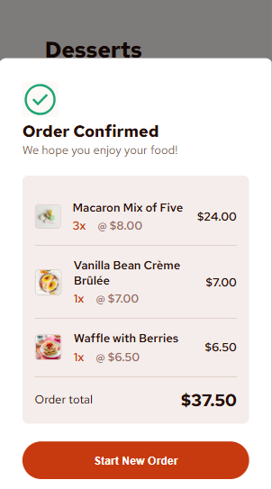

# Frontend Mentor - Product list with cart solution

This is a solution to the [Product list with cart challenge on Frontend Mentor](https://www.frontendmentor.io/challenges/product-list-with-cart-5MmqLVAp_d). It provides a user-friendly shopping cart experience with dynamic interactions and responsive design. 

## Table of contents

- [Overview](#overview)
  - [The challenge](#the-challenge)
  - [Screenshot](#screenshot)
  - [Links](#links)
- [Other](#other)

## Overview

This project implements a responsive shopping cart interface where users can add, remove, and adjust item quantities, confirm orders with a modal, and reset selections to start a new order. It includes interactive hover and focus states for a seamless user experience across different screen sizes, using HTML, CSS, and JavaScript.

### The challenge

Users should be able to:

- Add items to the cart and remove them
- Increase/decrease the number of items in the cart
- See an order confirmation modal when they click "Confirm Order"
- Reset their selections when they click "Start New Order"
- View the optimal layout for the interface depending on their device's screen size
- See hover and focus states for all interactive elements on the page

### Screenshot

  
  

  
  

### Links

- Live Site URL: [Add live site URL here](https://your-live-site-url.com)

## Other

Other Projects:
- Portfolio Website - [angeline-portfolio.netlify.app](https://angeline-portfolio.netlify.app)
